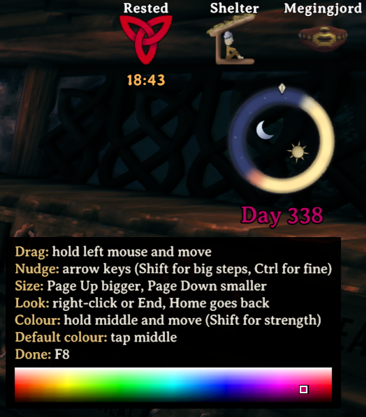

# Daywheel

A small day and night wheel for your HUD, so you can see at a glance how much
daylight is left.

The mark at the top is "now". The ring turns as the day goes on, so the
distance from the mark to the dark part is the daylight you've got left. The
day number sits underneath.

It follows the game's own clock. Day runs from a quarter to three quarters of
the way through each 20 minute cycle, so the light and dark halves match the
sky you're under.



## Themes

There are seven looks to pick from:

- **Ember and moonstone** (the default): amber by day, deep blue at night
- **Northern twilight**: pale gold and indigo, a bit softer
- **Rootbound forest**: a ring of roots and leaves, mossy at night
- **Dvergr lantern**: an eight-sided gold and violet frame
- **The wolf chase**: a light wolf and a dark wolf chasing each other's tails
- **Mountain relic**: frost-blue carved stone
- **Ashlands**: black rock with lava running through it

Set one in the config, or flip through them in game (see below).

## Moving and resizing

Press **F8** to move the wheel. A small menu opens beside it, listing the
keys, and it stays on screen wherever the wheel goes. Your character stands
still until you finish. Put away a hammer, hoe or cultivator first: while
one is out, the game uses the mouse for building. Then:

- hold the left mouse button and move the mouse to drag the wheel. You don't
  need to point at it, so it works anywhere on screen
- **Page Up** and **Page Down** (or **+** and **-**) make it bigger or smaller
- the arrow keys nudge it (hold Shift for bigger steps, Ctrl for smaller)
- right-click, or press **End**, for the next look, and **Home** for the one
  before
- hold the middle mouse button and move the mouse to pick the day number's
  colour: left and right change the colour, up and down make it lighter or
  darker, and with Shift held, stronger or softer. A small field in the menu
  shows where you are. A quick tap of the middle button puts back the colour
  it came with

Press **F8** again when you're done, and your controls come back. The
position, size, look and colour are saved. Opening your bag, the map, the
build menu or the game menu also ends it.

It's done this way so the minimap stays in view while you line the wheel up.
The bag's crafting panel and the big map both cover that corner.

## Config

| Setting | What it does |
|---|---|
| `Show` | Turns the wheel on or off |
| `ShowDayCount` | Shows the day number under the wheel |
| `DayColor` | The day number's colour, as a hex code. `FFFFFF` is white |
| `Size` | Width, in the game's interface units, so it follows the game's UI scale |
| `X`, `Y` | Position, measured from the top right corner |
| `Theme` | Which look to use, spelled exactly as listed above |
| `Glow` | Glow strength. 1 is normal, 0 turns it off |
| `MoveKey` | The key for moving the wheel, F8 by default |

You can change these in your mod manager's config editor, or in Daywheel's
file in `BepInEx/config`. You won't usually need to touch `Size`, `X` or `Y`
yourself, since dragging the wheel sets them.

## Installing

Install it from Thunderstore with a mod manager, such as r2modman or the
Thunderstore Mod Manager. To install a zip by hand, go to **Settings → Import
local mod** in the mod manager and pick it.

It needs BepInEx, which the mod manager installs along with it.

## Compatibility

Daywheel doesn't patch the game and doesn't add anything to the network, so
it's purely client side. Friends without it can still join your server, and
it never changes your world or character files. The only file it writes is
its own config. While you're moving the wheel it pauses your character's
controls, and it gives them back the moment you finish. If something goes
wrong inside it, it logs one line and keeps going.

## Building from source

You'll need the .NET 8 SDK or newer, plus some DLLs from your own Valheim
install. They aren't included here, so copy them yourself into a folder
called `refs` at the top of the repo:

- From `Valheim/valheim_Data/Managed/`: `assembly_valheim.dll`,
  `assembly_utils.dll`, `UnityEngine.dll`, `UnityEngine.CoreModule.dll`,
  `UnityEngine.UI.dll`, `UnityEngine.UIModule.dll`,
  `UnityEngine.TextRenderingModule.dll`,
  `UnityEngine.InputLegacyModule.dll`, `UnityEngine.ImageConversionModule.dll`
  and `Unity.TextMeshPro.dll`
- From your BepInEx `core` folder: `BepInEx.dll`

Then run:

```
dotnet build src/Daywheel.csproj -c Release
```

That leaves `Daywheel.dll` in `src/bin/Release`. The pictures are built into
it, so it's the only file the mod needs in `BepInEx/plugins`. If the DLLs are
somewhere else, add `-p:RefDir=<that folder>`.

Built against Valheim `25253791`, BepInEx 5.x and the Thunderstore pack
`denikson-BepInExPack_Valheim-5.4.2350`, which the package lists as its one
dependency, so a mod manager installs BepInEx along with it.

## Licence

MIT. See `LICENSE`.
